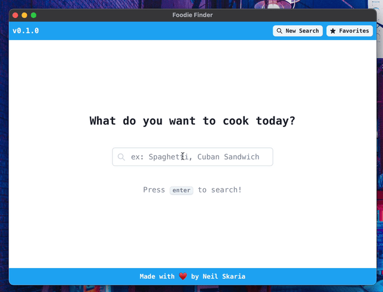

<!-- Improved compatibility of back to top link: See: https://github.com/othneildrew/Best-README-Template/pull/73 -->

<a name="readme-top"></a>

<!-- PROJECT LOGO -->
<br />
<div align="center">
    
<h3 align="center">Foodie Finder</h3>
  <p align="center">
    Recipe sites are inundated with ads and information that is distracting.
   </p>
   <p>
    This is a convenient and private desktop application built in Tauri to find recipes from a search bar, scrape the important information and save them locally to your machine.
   </p>
</div>

<!-- ABOUT THE PROJECT -->

## Overview

<div align="center">
    
</div>

### Why I Built This

I am in the process of learning Rust and desktop application development. This was a fun learning experiment to get me used to syntax and community libraries.

My fiancee had expressed how messy recipe websites were and how they show so many ads. This was the inspiration for Foodie Finder.

Getting married in 2024. <3

### Features

- Search-box interface to find recipes from a text prompt
- Scrapes websites and filters out those with incomplete datasets (much love for the recipe-scrapers library)
- Ability to save recipes to local sqlite db

### Platforms

- Only tested on MacOS

### Built With

- Rust
- Tauri
- Next.js / React

## Getting Started

To get a local copy up and running follow these simple example steps.

### Prerequisites

1. Must have python 3.11 installed
2. Must have Rust and toolchain installed

### Build the application

1. Get a free Edamam API Key (no credit card required) at [https://www.edamam.com/](https://example.com)
2. Clone the repo
   ```sh
   git clone https://github.com/Skarian/foodiefinder.git
   ```
3. Add `app_id` and `app_key` environment variables in `/src-tauri/.env`. Example below
   ```sh
   app_id=c5re916e
   app_key=19bb82b76d80a3185f88d3c2daef6315
   ```
4. Install python dependencies `pip install recipe-scrapers`
5. Install NPM dependencies `npm install`
6. Run `cargo tauri build`
7. The executable will be under the target folder: `/src-tauri/target/`. Feel free to move it wherever you prefer

<!-- ROADMAP -->

## Roadmap (maybe?)

- [ ] Edit saved recipe data
- [ ] Ability to add specific recipe URLs
- [ ] AI-enhanced generation

<!-- CONTRIBUTING -->

## Contributing

This was just a quick side project that already meets my goals. Not really looking for it to be a major open-source project but if there is community interest here I am happy to continue development.

## License

Distributed under the MIT License. See `LICENSE.txt` for more information.

<!-- CONTACT -->

## Contact

Neil Skaria - [@skar_ai](https://twitter.com/skar_ai) - neil.skaria@gmail.com

Project Link: [https://github.com/Skarian/foodiefinder](https://github.com/github_username/repo_name)

## Usage Note

This project is for demonstration / non-commercial usage only, please follow relevant regulation where appropriate
